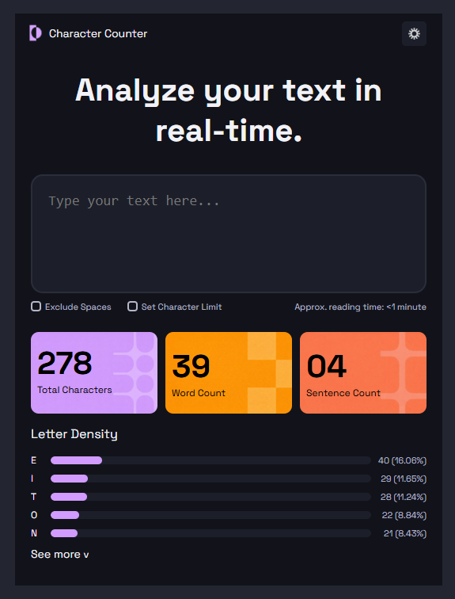

# 📘 Proyecto de Maquetado Web

---

## 📌 Descripción
Este proyecto es un **trabajo práctico** en el cual se crean métricas a las que luego le agregaremos **JavaScript** para añadir interactividad y dinamismo.

---

## 🛠️ Tecnologías utilizadas
- **HTML5** → estructura del contenido de la aplicación.  
- **CSS3** → diseño visual, estilos y distribución de los elementos en la interfaz.  

---

## 🧩 Organización del HTML

El documento está organizado en bloques principales:

- **Head**  
  Contiene la configuración inicial del proyecto:  
  - Codificación (`UTF-8`) y viewport para diseño responsive.  
  - Título de la página.  
  - Enlace al archivo `style.css`.  
  - Importación de la tipografía *Inter* desde Google Fonts.  

- **Body**  
  Todo el contenido visible se encuentra dentro de dos contenedores (`.background` y `.container`) que agrupan la interfaz.  
  - **Header**: incluye el logo con imagen y texto, y un botón para cambiar el color del tema.  
  - **Área de texto**: título principal y un `<textarea>` para que el usuario ingrese el texto a analizar.  
  - **Opciones**: dos checkboxes personalizados (“Exclude Spaces” y “Set Character Limit”) y un texto con el tiempo estimado de lectura.  
  - **Tarjetas métricas**: tres tarjetas que muestran el total de caracteres, cantidad de palabras y cantidad de oraciones.  
  - **Sección de métricas**: subtítulo “Letter Density”, barras de progreso que muestran la frecuencia de letras y un desplegable “See more” con información adicional.  

En resumen, la estructura del HTML sigue una lógica clara:  
1. Configuración en el `<head>`.  
2. Contenedor principal en el `<body>`.  
3. Secciones organizadas en bloques: **encabezado, entrada de texto, opciones, métricas principales y métricas detalladas**.

---

## 🎨 Resolución del CSS

Para el desarrollo de los estilos se aplicaron las siguientes estrategias:

- **Reset inicial**: Se eliminó el margen y padding por defecto de los navegadores y se definió `box-sizing: border-box` para hacer un reseteo de los elementos.  
- **Variables CSS**: Se configuró una paleta de colores en `:root` (`--main-bg`, `--secondary-text`, `--progress-bars`, etc.), para tener un contol sobre los colores.  
- **Estructura y layout**:  
  - Se utilizó **Flexbox** en el `header`, el contenedor principal y las tarjetas métricas para lograr alineación y distribución responsiva.  
  - Se aplicó **CSS Grid** en la sección `.bars` para organizar letra, barra de progreso y porcentaje en columnas bien definidas.  
- **Componentes personalizados**:  
  - **TextArea**: fondo oscuro, bordes redondeados y tipografía legible para mejorar la experiencia de escritura.  
  - **Checkboxes**: se ocultó el estilo nativo (`appearance: none`) y se diseñó un cuadrado con borde y check ✓ al marcar.  
- **Tarjetas métricas**: cada tarjeta (`.purple-card`, `.yellow-card`, `.orange-card`) utiliza una imagen de fondo distinta y un efecto *hover* con `transform: scale` y `box-shadow` para dar dinamismo.  
- **Botón de cambio de color**: se implementó con transiciones en `background` y `transform`, además de un ícono que cambia de contraste al pasar el cursor.  
- **Barras de progreso**: se personalizaron los pseudo-elementos `::-webkit-progress-bar` y `::-webkit-progress-value`, aplicando colores de la paleta y un efecto *hover* que resalta la interacción.  
- **Animaciones y transiciones**: se añadieron transiciones suaves (`transition: ease`) en botones, barras y tarjetas para generar una interfaz más fluida.  
- **Sección “See More”**: se estilizó el `summary` para mostrar un ícono "v" que rota al abrir el detalle.

---

## ⚡ Dificultades encontradas

Durante el desarrollo se presentaron algunos desafíos:

- **Checkboxes**: al intentar aplicar transparencia, el check desaparecía. Para resolverlo se tuvo que crear manualmente el símbolo ✓.
- **Barras de progreso**: el diseño del elemento `<progress>` no se personaliza de manera común, por lo que fue necesario aprender a usar prefijos como `-webkit-` para lograr un estilo consistente en distintos navegadores.  
- **Aprendizaje adicional**: se exploraron diferentes técnicas y propiedades de CSS que no eran conocidas previamente, lo que enriqueció el proceso de desarrollo.  

---

## ✅ Resultado final

El resultado final del proyecto es el siguiente:

